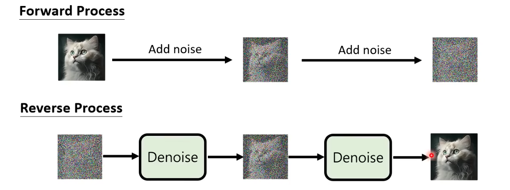
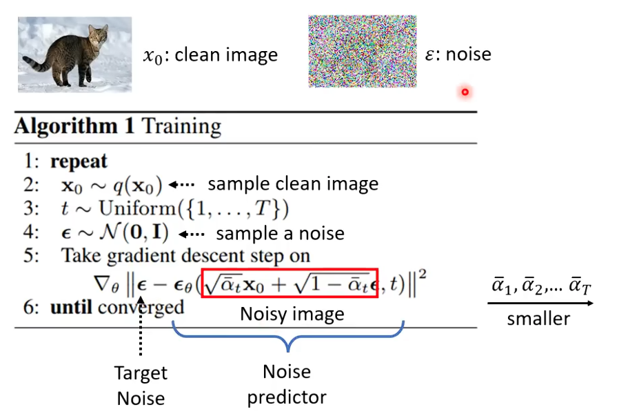
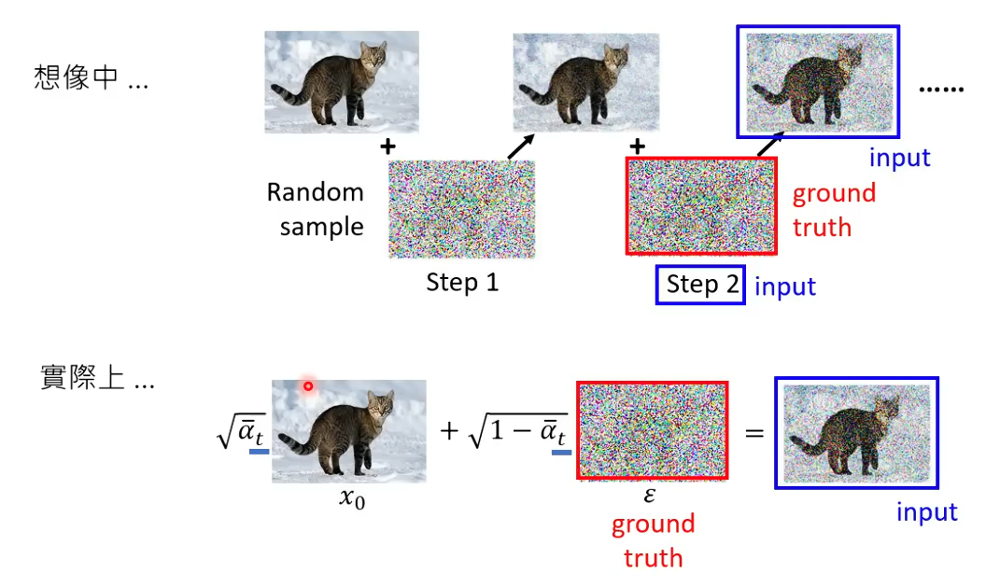
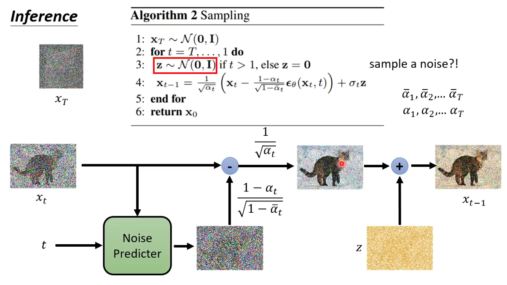
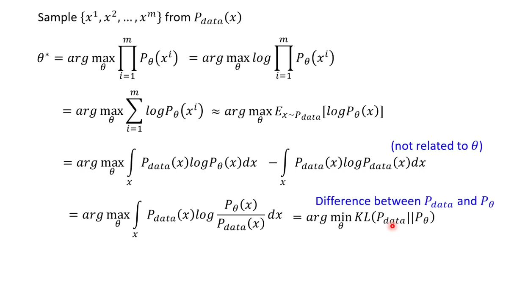
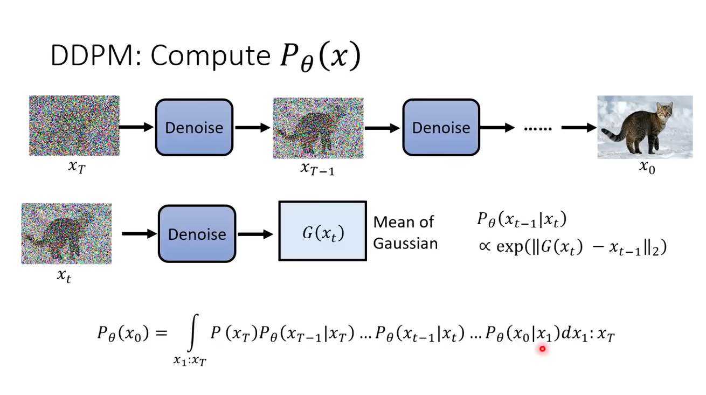
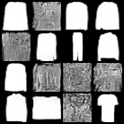

# 扩散模型学习记录
这是和哈基米一起学习的第一次内容，主要关于扩散模型的原理和应用。
## 1. 数学原理
### 简述
扩散模型的前向过程（Forward Process）是一个马尔可夫链。在时刻 $t$，图像 $x_t$ 的分布由 $x_{t-1}$ 决定：

$$
q(x_t | x_{t-1}) = \mathcal{N}(x_t; \sqrt{1 - \beta_t} x_{t-1}, \beta_t \mathbf{I})
$$

通过重参数化技巧，我们可以直接从 $x_0$ 得到任意时刻 $x_t$：

$$
x_t = \sqrt{\bar{\alpha}_t} x_0 + \sqrt{1 - \bar{\alpha}_t} \epsilon
$$

其中 $\epsilon \sim \mathcal{N}(0, \mathbf{I})$ 是高斯噪声。

首先，我们明确一个概念，图像生成模型想做的一件事是学习真实图像的概率分布即$p_{data}(x|c)$,其中x是真实世界图像，c是文本条件。第一次看到真实图像的概率分布时，大家可能都有点懵逼。打个比方，一张$224\*224\*3$的图像，每个像素点上的RBG通道值都可以容易取值，那么可以得到的图像是天文级别，但是真实世界是不可能的，你无法看到黑色的雪花、弯腰的钢背兽。所以，真实世界的所有图像其实是满足一个概率分布的。

但是这个分布太复杂了，根本无法直接采样来还原，所以diffusion做了一个巧妙的操作:换一个好采样的点。我无法知道我想要复杂自然图像的概率分布，但是我将复杂分布慢慢抹平为高斯噪声，那么生成的时候只需要与抹平的操作反过来就行了，对应的就是加噪和去噪，我们学习的是这一过程，而非原始分布。那么为什么现在图像生成的输入都是噪声，而我们的提示词只是约束条件呢？打个比方：如果我们直接用提示词来生成图片，“一只在雪地里的白色哈士奇”对应现实世界会有无穷多张合理的图像，如果我们要拟合这样一个一对多的模型太复杂了，而且压根无法建立损失和训练方向。但是如果我们用噪声来提供随机性，决定“是哪一种可能世界”，就要容易得多！！！

在深度学习中Diffusion Model的前向和反向的过程如下：
### 去噪与加噪


这个前向加噪-反向去噪的过程可以理解为另类的encoder-decoder模型。

在加噪的过程中，我们选定了一组参数$\alpha_1, \alpha_2, \cdots$作为权重参数，代表不同步的加噪程度。通过公式$\sqrt{\bar{\alpha}_t} x_0 + \sqrt{1 - \bar{\alpha}_t} \epsilon$得到加噪后的模糊图像（注意，$hat{\alpha}_t = \sum_0^t \alpha_i$, 相当于累计每一步的加噪程度来计算单步加噪程度，逐渐变大，代表图片加噪越来越多，图片越来越模糊）。而训练这是通过加噪图像和步骤$t$来预测加入噪声的形状。公式如下：$min|\epsilon - \hat{\epsilon}(\sqrt{\bar{\alpha}_t} x_0 + \sqrt{1 - \bar{\alpha}_t} \epsilon, t)|$



这里加噪过程需要注意一个点，实际上训练的过程不是理想中的马尔科夫链那样，由此状态$x_t$预测上一状态$x_{t-1}$(一步步加噪)；我们是通过原本的图像混入严重噪声的图像和此时的步骤$t$去预测加入的噪声。这是因为，实际上前后两次加噪可以等同于一次加噪：



然后我们用$\alpha$来替换这里的$\beta$。

在去噪（生成图像）过程中，同样有一个非常有意思的点。理论上噪声图像减去预测的噪声形状应该等于我们想要的上一步加噪图像，但是我们最终还加上了一个高斯噪声。为什么？



还是那个问题，我们虽然学习的是加噪和去噪的过程，但是我们目标是学习真实世界的分布，真实世界是随机的。如果我们不采样噪声，就是在假装这个分布是“退化成一个点”的。从数学角度上来讲，我们的前向扩散过程是$q(x_t|x_{t-1})=\mathcal{N}(\sqrt{\bar{\alpha}_t} x_{t-1},(1-\bar{\alpha}_t)\mathbf{I})$,这是一个随机映射，所以反向分布也一定是随机的。

### KL散度
KL散度是图像生成模型常用的损失函数，回到最初的问题，我们学习的是加噪和去噪的过程，而非原始分布，那么我如何定义一个函数来评估生成图像和实际图像的差异，或者说如何评估我的模型根据输入能够生成出对应图像的概率？这就是KL散度做的事，它的含义可以理解为如果真实世界按我们的数据集$P_{data}$来说话，而我用$P_{\zeta}$来解释，会浪费多少信息。推导公式如下：



对于diffusion来说：



也就是每个时间步，我如何把图像往真实方向推一点点，于是目标变成了:$\sum_{t=1}^T E[D_{KL}(q(x_{t-1}|x_t),x_0)||p_{\zeta}(x_{t-1}|x_t)]$

在合适的参数化下，上面的目标等价于MSE:$E_{x_0,\epsilon,t}[||\epsilon - \epsilon_{\zeta}(x_t,t)||^2]$

## 2. 代码实现
### 2.1 原始框架
第一次示例：

```python
# dataset.py
import torch
import torchvision
from torchvision import transforms
from torch.utils.data import DataLoader

def get_dataloader(batch_size=64, img_size=32):
    """
    加载 FashionMNIST 并进行预处理：
    1. Resize 到 32x32 (适应 UNet 结构)
    2. 转为 Tensor
    3. 归一化到 [-1, 1] (Diffusion 必须!)
    """
    
    tf = transforms.Compose([
        transforms.Resize((img_size, img_size)), # 1. 放大图片到 32x32
        transforms.ToTensor(),                   # 2. 变成 Tensor，范围变 [0, 1]
        transforms.Normalize((0.5,), (0.5,))     # 3. (x - 0.5) / 0.5 -> 范围变 [-1, 1]
    ])

    # 直接使用官方数据集，把 transform 传进去
    dataset = torchvision.datasets.FashionMNIST(
        root="./data", 
        train=True, 
        download=True, 
        transform=tf  
    )

    # 封装成 DataLoader (帮你处理 batch 和 shuffle)
    dataloader = DataLoader(dataset, batch_size=batch_size, shuffle=True, drop_last=True)
    
    return dataloader
```

```python
#modules.py
#此处我们采用unet网络来做扩散模型的基础网络结构，与经典的unet网络不同，我们需要让unet网络有时间观念，也就是知道当前是第几步。
import torch
import torch.nn as nn
import torch.nn.functional as F
import math

class SinusoidalpositionalEmbedding(nn.Module):
    """
    将一个整数t变为一个特征向量。
    原理和Transformer的位置编码一样，用sin/cos函数。
    以此来让网络明白500和501很近，和100很远。
    """
    def __init__(self,dim):
        super().__init__()
        self.dim = dim

    def forward(self,time):
        device = time.device
        half_dim = self.dim//2
        embeddings = math.log(10000)/ (half_dim -1)
        embeddings = torch.exp(torch.arange(half_dim,device=device)* -embeddings)
        embeddings = time[:, None] * embeddings[None, :]
        embeddings = torch.cat((embeddings.sin(), embeddings.cos()), dim=-1)
        return embeddings
    
class DoubleConv(nn.Module):
    """这是采用LN的卷积块，用于搭建unet网络,不用BN的原因是Diffusion模型中batch size通常较小，BN效果不好"""
    def __init__(self,in_channels,out_channels):
        super().__init__()
        self.double_conv = nn.Sequential(
            nn.Conv2d(in_channels,out_channels,kernel_size=3,padding=1),
            nn.GroupNorm(1,out_channels),#相当于LN
            nn.GELU(),
            nn.Conv2d(out_channels,out_channels,kernel_size=3,padding=1),
            nn.GroupNorm(1,out_channels),
            nn.GELU()
        )
    def forward(self,x):
        return self.double_conv(x)
    
class UNet(nn.Module):
    def __init__(self,c_in=1,c_out=1,time_dim=256,device ="cuda"):
        super().__init__()
        self.device = device
        self.time_dim = time_dim
        
        #1.输入层
        self.inc = DoubleConv(c_in,64)
        
        #2.下采样路径
        self.down1 = DoubleConv(64, 128)
        self.sa1 = nn.Identity() # 这里可以加 Attention，为了简单先留空
        self.down2 = DoubleConv(128, 256)
        self.sa2 = nn.Identity()
        self.down3 = DoubleConv(256, 256)
        self.sa3 = nn.Identity()
        
        #3.底部
        self.bot1 = DoubleConv(256, 512)
        self.bot2 = DoubleConv(512, 512)
        self.bot3 = DoubleConv(512, 256)

        #4.上采样路径(你使用反卷积，因为容易有棋盘伪影，使用放大+卷积)
        self.up1 = DoubleConv(512, 128) # 256 + 256 (skip connection)
        self.sa4 = nn.Identity()
        self.up2 = DoubleConv(256, 64)  # 128 + 128
        self.sa5 = nn.Identity()
        self.up3 = DoubleConv(128, 64)  # 64 + 64
        self.sa6 = nn.Identity()

        #5.输出层
        self.outc = nn.Conv2d(64,c_out,kernel_size = 1)

        #6.下采样和上采样的工具
        self.maxpool = nn.MaxPool2d(2)
        self.upsample = nn.Upsample(scale_factor=2,mode="bilinear",align_corners=True)

        #7.时间步嵌入的全连接层
        self.time_mlp = nn.Sequential(
            SinusoidalpositionalEmbedding(time_dim),
            nn.Linear(time_dim,time_dim),
            nn.GELU(),
            nn.Linear(time_dim,time_dim)
        )

    def forward(self,x,t):
        #1.处理时间
        t = t.unsqueeze(-1).type(torch.float)
        t = self.time_mlp(t)
        
        #2.下采样
        x1 = self.inc(x)  # (B,64,H,W)
        x2 = self.down1(self.maxpool(x1)) # (B,128,H/2,W/2)
        x3 = self.down2(self.maxpool(x2)) # (B,256,H/4,W/4)
        x4 = self.down3(self.maxpool(x3)) # (B,256,H/8,W/8)

        #3.底部
        x4 = self.bot1(x4)
        x4 = self.bot2(x4)
        x4 = self.bot3(x4)

        #4.上采样
        x = self.upsample(x4)
        x = torch.cat((x,x3),dim=1)
        x = self.up1(x)
        
        x = self.upsample(x)
        x = torch.cat((x,x2),dim=1)
        x = self.up2(x)

        x = self.upsample(x)
        x = torch.cat((x,x1),dim=1)
        x = self.up3(x)

        #5.输出层
        output = self.outc(x)
        return output
    
if __name__ == "__main__":
    import torch
    # 模拟输入
    # Batch=3, Channel=1 (黑白图), Size=32x32
    x = torch.randn(3, 1, 32, 32)
    # 随机生成 3 个时间步 t
    t = torch.randint(0, 1000, (3,))
    
    # 实例化模型
    model = UNet()
    
    # 前向传播
    preds = model(x, t)
    
    print(f"输入形状: {x.shape}")
    print(f"输出形状: {preds.shape}")
    
    if x.shape == preds.shape:
        print("✅ 成功！输入和输出形状一致，网络搭建完成！")
    else:
        print("❌ 失败！输出形状不对，必须和输入完全一样。")
    
```

```python
#diffusion.py
import torch
import torch.nn.functional as F
from tqdm import tqdm
class Diffusion:
    def __init__(self, noise_steps=1000, beta_start=1e-4, beta_end=0.02, img_size=32, device="cuda"):
        self.noise_steps = noise_steps
        self.beta_start = beta_start
        self.beta_end = beta_end
        self.img_size = img_size
        self.device = device
        
        # 1. 准备噪声调度表 (Beta Schedule)
        self.beta = self.prepare_noise_schedule().to(device)
        
        # 2. 计算 Alpha 及相关变量 (核心数学公式)
        self.alpha = 1. - self.beta
        # 任务：计算 alpha_hat (即 alpha 的累乘 cumprod)
        self.alpha_hat = torch.cumprod(self.alpha, dim=0) # <--- 填空
        
    def prepare_noise_schedule(self):
        # 任务：生成从 beta_start 到 beta_end 的线性序列
        return torch.linspace(self.beta_start, self.beta_end, self.noise_steps)

    def noise_images(self, x, t):
        """
        x: 输入图像 batch (Batch, 3, 32, 32)
        t: 时间步 batch (Batch,)
        返回: (加噪后的图, 也就是 x_t,  添加的噪声 noise)
        """
        sqrt_alpha_hat = torch.sqrt(self.alpha_hat[t])[:, None, None, None]
        sqrt_one_minus_alpha_hat = torch.sqrt(1 - self.alpha_hat[t])[:, None, None, None]
        
        epsilon = torch.randn_like(x)
        
        # 任务：根据公式 x_t = sqrt(alpha_hat) * x + sqrt(1 - alpha_hat) * epsilon 实现
        return sqrt_alpha_hat * x + sqrt_one_minus_alpha_hat * epsilon, epsilon 

    def sample_timesteps(self, n):
        """随机采样时间步 t，用于训练"""
        return torch.randint(low=1, high=self.noise_steps, size=(n,), device=self.device)

    def sample(self,model,n,labels=None,cfg_scale=3):
        print(f"Sampling {n} new images...")
        model.eval()
        with torch.no_grad():
            # 初始形态：纯高斯噪声，我们用的1通道，因为FashionMNIST时黑白数据集
            x = torch.randn((n,1,self.img_size,self.img_size)).to(self.device)

            for i in tqdm(reversed(range(1,self.noise_steps)),position=0):
                t = (torch.ones(n)*i).long().to(self.device)

                predicted_noise = model(x,t)

                #x_{t-1} = 1/sqrt(alpha) * (x_t - ...) + sigma * z

                alpha = self.alpha[t][:, None, None, None]
                alpha_hat = self.alpha_hat[t][:, None, None, None]
                beta = self.beta[t][:, None, None, None]
                
                if i > 1:
                    noise = torch.randn_like(x)
                else:
                    noise = torch.zeros_like(x) # 最后一步不加噪
                
                # 5. 核心公式：减去预测的噪声，加上一点点随机扰动
                x = (1 / torch.sqrt(alpha)) * (x - ((1 - alpha) / (torch.sqrt(1 - alpha_hat))) * predicted_noise) + torch.sqrt(beta) * noise
                
        model.train()
        
        # 6. 还原：把数值从 [-1, 1] 变回 [0, 1] 以便保存成图片
        x = (x.clamp(-1, 1) + 1) / 2
        x = (x * 255).type(torch.uint8)
        return x


# --- 测试代码 ---
if __name__ == "__main__":
    # 模拟一张随机图片
    images = torch.randn(8, 3, 32, 32).to("cuda") # 假设 batch_size=8
    diff = Diffusion(device="cuda")
    
    # 随机采样时间步
    t = diff.sample_timesteps(8)
    
    # 加噪
    x_t, noise = diff.noise_images(images, t)
    
    print(f"输入形状: {images.shape}")
    print(f"加噪后形状: {x_t.shape}")
    print("代码跑通了！")
```

```python
#train.py
import os
import torch.nn as nn
from torch import optim
from tqdm import tqdm
import torch
from modules import UNet
from dataset import get_dataloader
from diffusion import Diffusion

def train():
    # 1.配置参数
    device = "cuda" if torch.cuda.is_available() else "cpu"
    print(f"Using device: {device}")

    batch_size = 64
    image_size = 32
    learning_rate = 3e-4
    epochs = 10

    # 2.初始化组件
    dataloader = get_dataloader(batch_size=batch_size, img_size=image_size)

    model = UNet(device=device).to(device)

    optimizer = optim.AdamW(model.parameters(), lr=learning_rate)

    mse = nn.MSELoss()

    diffusion = Diffusion(img_size=image_size, device=device)

    if not os.path.exists("models"):
        os.makedirs("models")
    
    # 3.训练
    for epoch in range(epochs):
        print(f"Starting epoch {epoch}/{epochs}...")

        pbar = tqdm(dataloader)

        for i,(images,labels) in enumerate(pbar):
            # 准备数据
            images = images.to(device)
            # 随机采样时间步t
            t = diffusion.sample_timesteps(images.shape[0])
            # 加噪
            x_t, noise = diffusion.noise_images(images, t)
            
            # 预测噪声
            predicted_noise = model(x_t, t)
            
            # 计算损失
            loss = mse(noise, predicted_noise)

            #反向传播
            optimizer.zero_grad()
            loss.backward()
            optimizer.step()

            # 更新进度条
            pbar.set_postfix(MSE=loss.item())

            # --- 4. 保存模型 ---
            if i % 10 == 0:
                torch.save(model.state_dict(), f"models/ckpt.pt")
                print(f"Epoch {epoch+1} 模型已保存到 models/ckpt.pt")

if __name__ == "__main__":
    train()

```

```python
#inference.py
import torch
import torchvision
from modules import UNet
from diffusion import Diffusion
import os

def generate_images():
    #1.设置配置
    device = "cuda" if torch.cuda.is_available() else "cpu"
    model_path = "models/ckpt.pt"

    #2.初始化模型
    model = UNet(device=device).to(device)

    #3.加载权重
    if os.path.exists(model_path):
        loaded_state = torch.load(model_path)
        model.load_state_dict(loaded_state)
        print("模型权重加载成功")
    else:
        print("模型权重不存在")
        return
    
    # 4.初始化扩散工具
    diffusion = Diffusion(img_size=32,device=device)

    # 5. 开始采样,生成 16 张图
    sampled_images = diffusion.sample(model, n=16)
    
    # 6. 保存结果
    if not os.path.exists("results"):
        os.mkdir("results")
        
    # 把 16 张图拼成一个 4x4 的大方格
    # 需要把 uint8 转回 float 0-1 才能让 make_grid 处理
    save_images = sampled_images.float() / 255.0
    grid = torchvision.utils.make_grid(save_images, nrow=4)
    torchvision.utils.save_image(grid, "results/generated_fashion.png")
    print("✅ 图片已生成，保存在 results/generated_fashion.png")

if __name__ == "__main__":
    generate_images()
```

结果如下：


### 2.2 条件控制和UNet升级

接下来，我们进行一下大的改进：
- 条件控制 (Conditional Generation)：我们将加入 Label Embedding。把“类别信息”和“时间信息”相加，一起注入到网络里。这样模型不仅知道“现在是第几步”，还知道“老板让我画鞋子还是裤子”。

- UNet 架构升级：
    - 时间融合优化：不再是只在某一层加时间，而是像真正的 ResNet 那样，把时间嵌入投影到每一层卷积中。
    - 自注意力机制 (Self-Attention)：在图像变小（特征变深）的层级加入 Attention，让模型能“看到全局”，画出更合理的结构（比如鞋带要对称）。

修改代码如下：
```
# diffuison.py
import torch
import torch.nn.functional as F
from tqdm import tqdm
class Diffusion:
    def __init__(self, noise_steps=1000, beta_start=1e-4, beta_end=0.02, img_size=32, device="cuda"):
        self.noise_steps = noise_steps
        self.beta_start = beta_start
        self.beta_end = beta_end
        self.img_size = img_size
        self.device = device
        
        # 1. 准备噪声调度表 (Beta Schedule)
        self.beta = self.prepare_noise_schedule().to(device)
        
        # 2. 计算 Alpha 及相关变量 (核心数学公式)
        self.alpha = 1. - self.beta
        # 任务：计算 alpha_hat (即 alpha 的累乘 cumprod)
        self.alpha_hat = torch.cumprod(self.alpha, dim=0) # <--- 填空
        
    def prepare_noise_schedule(self):
        # 任务：生成从 beta_start 到 beta_end 的线性序列
        return torch.linspace(self.beta_start, self.beta_end, self.noise_steps)

    def noise_images(self, x, t):
        """
        x: 输入图像 batch (Batch, 3, 32, 32)
        t: 时间步 batch (Batch,)
        返回: (加噪后的图, 也就是 x_t,  添加的噪声 noise)
        """
        sqrt_alpha_hat = torch.sqrt(self.alpha_hat[t])[:, None, None, None]
        sqrt_one_minus_alpha_hat = torch.sqrt(1 - self.alpha_hat[t])[:, None, None, None]
        
        epsilon = torch.randn_like(x)
        
        # 任务：根据公式 x_t = sqrt(alpha_hat) * x + sqrt(1 - alpha_hat) * epsilon 实现
        return sqrt_alpha_hat * x + sqrt_one_minus_alpha_hat * epsilon, epsilon 

    def sample_timesteps(self, n):
        """随机采样时间步 t，用于训练"""
        return torch.randint(low=1, high=self.noise_steps, size=(n,), device=self.device)

    def sample(self,model,n,labels=None,cfg_scale=3):
        print(f"Sampling {n} new images...")
        model.eval()
        with torch.no_grad():
            # 初始形态：纯高斯噪声，我们用的1通道，因为FashionMNIST时黑白数据集
            x = torch.randn((n,1,self.img_size,self.img_size)).to(self.device)

            for i in tqdm(reversed(range(1,self.noise_steps)),position=0):
                t = (torch.ones(n)*i).long().to(self.device)

                predicted_noise = model(x,t)

                #x_{t-1} = 1/sqrt(alpha) * (x_t - ...) + sigma * z

                alpha = self.alpha[t][:, None, None, None]
                alpha_hat = self.alpha_hat[t][:, None, None, None]
                beta = self.beta[t][:, None, None, None]
                
                if i > 1:
                    noise = torch.randn_like(x)
                else:
                    noise = torch.zeros_like(x) # 最后一步不加噪
                
                # 5. 核心公式：减去预测的噪声，加上一点点随机扰动
                x = (1 / torch.sqrt(alpha)) * (x - ((1 - alpha) / (torch.sqrt(1 - alpha_hat))) * predicted_noise) + torch.sqrt(beta) * noise
                
        model.train()
        
        # 6. 还原：把数值从 [-1, 1] 变回 [0, 1] 以便保存成图片
        x = (x.clamp(-1, 1) + 1) / 2
        x = (x * 255).type(torch.uint8)
        return x


# --- 测试代码 ---
if __name__ == "__main__":
    # 模拟一张随机图片
    images = torch.randn(8, 3, 32, 32).to("cuda") # 假设 batch_size=8
    diff = Diffusion(device="cuda")
    
    # 随机采样时间步
    t = diff.sample_timesteps(8)
    
    # 加噪
    x_t, noise = diff.noise_images(images, t)
    
    print(f"输入形状: {images.shape}")
    print(f"加噪后形状: {x_t.shape}")
    print("代码跑通了！")
```
### 2.3 CFG

接下来，我们往这个框架中继续加入CFG，CFG(Classifier_Free Guidance)用于控制：模型听指示词的话的程度有多强。他的工作原理是在生成时，模型会做两次预测：有条件的预测和无条件的预测(带不带提示词)，再通过公式$final = uncond + s*(cond-uncond)$进行结合。其中，s就是CFG scale,本质上是放大提示词信号，数值越大，生成图片与提示词方向越近，但是太大又会导致生成细节不自然。

在训练过程中,我们需要加入随机概率(我设定为0.1)进行标签丢弃，当我们丢弃标签后，模型训练的是无条件下的生成，而后我们只需要在生成过程的采样函数中加入$final = uncond + s*(cond-uncond)$这一核心公式就可以了，代码如下：
```
# train.py
import os
import torch.nn as nn
from torch import optim
from tqdm import tqdm
import torch
from modules import UNet
from dataset import get_dataloader
from diffusion import Diffusion

def train():
    # 1.配置参数
    device = "cuda" if torch.cuda.is_available() else "cpu"
    print(f"Using device: {device}")

    batch_size = 64
    image_size = 32
    learning_rate = 3e-4
    epochs = 20

    # 2.初始化组件
    dataloader = get_dataloader(batch_size=batch_size, img_size=image_size)

    model = UNet(device=device).to(device)

    optimizer = optim.AdamW(model.parameters(), lr=learning_rate)

    mse = nn.MSELoss()

    diffusion = Diffusion(img_size=image_size, device=device)

    if not os.path.exists("models"):
        os.makedirs("models")
    
    # 3.训练
    for epoch in range(epochs):
        print(f"Starting epoch {epoch}/{epochs}...")

        pbar = tqdm(dataloader)

        for i,(images,labels) in enumerate(pbar):
            # 准备数据
            images = images.to(device)
            labels = labels.to(device)
            # 随机采样时间步t
            t = diffusion.sample_timesteps(images.shape[0])
            # 加噪
            x_t, noise = diffusion.noise_images(images, t)

            #---CFG修改---
            #10%概率丢弃标签，学习无条件生成
            if torch.rand(1).item()<0.1:
                predicted_noise = model(x_t,t,y=None)
            else:
                predicted_noise = model(x_t, t,labels)
            
            # 计算损失
            loss = mse(noise, predicted_noise)

            #反向传播
            optimizer.zero_grad()
            loss.backward()
            optimizer.step()

            # 更新进度条
            pbar.set_postfix(MSE=loss.item())

            # --- 4. 保存模型 ---
            if i % 10 == 0:
                torch.save(model.state_dict(), f"models/ckpt.pt")
                print(f"Epoch {epoch+1} 模型已保存到 models/ckpt.pt")

if __name__ == "__main__":
    train()

```

```
# diffusion.py
import torch
import torch.nn.functional as F
from tqdm import tqdm
class Diffusion:
    def __init__(self, noise_steps=1000, beta_start=1e-4, beta_end=0.02, img_size=32, device="cuda"):
        self.noise_steps = noise_steps
        self.beta_start = beta_start
        self.beta_end = beta_end
        self.img_size = img_size
        self.device = device
        
        # 1. 准备噪声调度表 (Beta Schedule)
        self.beta = self.prepare_noise_schedule().to(device)
        
        # 2. 计算 Alpha 及相关变量 (核心数学公式)
        self.alpha = 1. - self.beta
        # 任务：计算 alpha_hat (即 alpha 的累乘 cumprod)
        self.alpha_hat = torch.cumprod(self.alpha, dim=0) # <--- 填空
        
    def prepare_noise_schedule(self):
        # 任务：生成从 beta_start 到 beta_end 的线性序列
        return torch.linspace(self.beta_start, self.beta_end, self.noise_steps)

    def noise_images(self, x, t):
        """
        x: 输入图像 batch (Batch, 3, 32, 32)
        t: 时间步 batch (Batch,)
        返回: (加噪后的图, 也就是 x_t,  添加的噪声 noise)
        """
        sqrt_alpha_hat = torch.sqrt(self.alpha_hat[t])[:, None, None, None]
        sqrt_one_minus_alpha_hat = torch.sqrt(1 - self.alpha_hat[t])[:, None, None, None]
        
        epsilon = torch.randn_like(x)
        
        # 任务：根据公式 x_t = sqrt(alpha_hat) * x + sqrt(1 - alpha_hat) * epsilon 实现
        return sqrt_alpha_hat * x + sqrt_one_minus_alpha_hat * epsilon, epsilon 

    def sample_timesteps(self, n):
        """随机采样时间步 t，用于训练"""
        return torch.randint(low=1, high=self.noise_steps, size=(n,), device=self.device)

    def sample(self,model,n,labels=None,cfg_scale=3):
        print(f"Sampling {n} new images...")
        model.eval()
        with torch.no_grad():
            # 初始形态：纯高斯噪声，我们用的1通道，因为FashionMNIST时黑白数据集
            x = torch.randn((n,1,self.img_size,self.img_size)).to(self.device)

            for i in tqdm(reversed(range(1,self.noise_steps)),position=0):
                t = (torch.ones(n)*i).long().to(self.device)
                #--- CFG ---
                if cfg_scale>0 and labels is not None:
                    predicted_noise_cond = model(x,t,labels)

                    predicted_noise_uncond = model(x,t,y=None)

                    predicted_noise = predicted_noise_uncond + cfg_scale*(predicted_noise_cond-predicted_noise_uncond)
                else:
                    predicted_noise = model(x,t,labels)

                #x_{t-1} = 1/sqrt(alpha) * (x_t - ...) + sigma * z

                alpha = self.alpha[t][:, None, None, None]
                alpha_hat = self.alpha_hat[t][:, None, None, None]
                beta = self.beta[t][:, None, None, None]
                
                if i > 1:
                    noise = torch.randn_like(x)
                else:
                    noise = torch.zeros_like(x) # 最后一步不加噪
                
                # 5. 核心公式：减去预测的噪声，加上一点点随机扰动
                x = (1 / torch.sqrt(alpha)) * (x - ((1 - alpha) / (torch.sqrt(1 - alpha_hat))) * predicted_noise) + torch.sqrt(beta) * noise
                
        model.train()
        
        # 6. 还原：把数值从 [-1, 1] 变回 [0, 1] 以便保存成图片
        x = (x.clamp(-1, 1) + 1) / 2
        x = (x * 255).type(torch.uint8)
        return x


# --- 测试代码 ---
if __name__ == "__main__":
    # 模拟一张随机图片
    images = torch.randn(8, 3, 32, 32).to("cuda") # 假设 batch_size=8
    diff = Diffusion(device="cuda")
    
    # 随机采样时间步
    t = diff.sample_timesteps(8)
    
    # 加噪
    x_t, noise = diff.noise_images(images, t)
    
    print(f"输入形状: {images.shape}")
    print(f"加噪后形状: {x_t.shape}")
    print("代码跑通了！")
```

```
# inference.py
import torch
import torchvision
from modules import UNet
from diffusion import Diffusion
import os

def generate_images():
    #1.设置配置
    device = "cuda" if torch.cuda.is_available() else "cpu"
    model_path = "models/ckpt.pt"

    #2.初始化模型
    model = UNet(device=device).to(device)

    #3.加载权重
    if os.path.exists(model_path):
        loaded_state = torch.load(model_path)
        model.load_state_dict(loaded_state)
        print("模型权重加载成功")
    else:
        print("模型权重不存在")
        return
    
    # 4.初始化扩散工具
    diffusion = Diffusion(img_size=32,device=device)

    # 5. 开始采样,生成 16 张图,且全是靴子(class 9)
    n = 16
    target_class = 8
    labels = torch.tensor([target_class] * n).to(device)
    sampled_images = diffusion.sample(model, n, labels=labels,cfg_scale=9.0)
    
    # 6. 保存结果
    if not os.path.exists("results"):
        os.mkdir("results")
        
    # 把 16 张图拼成一个 4x4 的大方格
    # 需要把 uint8 转回 float 0-1 才能让 make_grid 处理
    save_images = sampled_images.float() / 255.0
    grid = torchvision.utils.make_grid(save_images, nrow=4)
    torchvision.utils.save_image(grid, "results/generated_fashion_cfg_9.png")
    print("✅ 图片已生成，保存在 results/generated_fashion.png")

if __name__ == "__main__":
    generate_images()
```
### 2.4 DDIM(去噪扩散隐式模型)
解决完控制力的问题后，我们来解决Diffusion模型的另外一个问题：生成速度太慢。我们使用DDIM进行提速。现在我们生成一张图片需要循环1000次，这对于小图来说还可以接受，一旦图片尺寸扩大，生成一批图片的时长将难以接受。**DDIM的核心目标就是将1000步压缩到几十步，而且不损失画质。**DDPM(马尔科夫链)每一步都以依赖前一步过程，而DDIM(非马尔科夫过程)可以实现跳步，并且不需要重新训练，只需要修改采样公式。

DDIM的逻辑分为两步：
 - 第一步:直接预测出原图。在第t步时，我们通过模型预测的噪声$\epsilon_\theta(x_t)$，利用逆向公式直接预测原图$x_0$：$$\text{Predicted } x_0 = \frac{x_t - \sqrt{1 - \bar{\alpha}_t} \epsilon_\theta(x_t)}{\sqrt{\bar{\alpha}_t}}$$
 - 第二步:指向上一个指定的检查点。我们利用终点的$x_0$，按照扩散公式，把终点的$x_0$加上第t-20步的噪声量，就可以退回到第 $t-20$ 步。$$x_{t-\Delta t} = \sqrt{\bar{\alpha}_{t-\Delta t}} (\text{Predicted } x_0) + \sqrt{1 - \bar{\alpha}_{t-\Delta t}} \epsilon_\theta(x_t)$$，DDIM对应把采样过程写成 ODE / 概率流的一条确定轨迹，所以DDPM需要加随机噪声，而DDIM可以不加噪声。这个逻辑对应的数学本质是将一个SDE(随机微分方程)变为了ODE(微分方程)问题。

我们现在在diffusion.py中新增一个ddim_sample函数：
```
    def ddim_sample(self,model,n,labels=None,cfg_scale=3.0,ddim_steps=50):
        """
        DDIM 采样算法：提速 20 倍的魔法
        ddim_steps: 压缩后的总步数
        """
        print(f"🚀 启动 DDIM 采样，计划生成 {n} 张图片，压缩至 {ddim_steps} 步...")
        with torch.no_grad():
            #初始化噪声
            x = torch.randn((n,1,self.img_size,self.img_size)).to(self.device)

            #生成跳步的时间步序列
            step_size = self.noise_steps//ddim_steps
            time_steps = reversed(range(0,self.noise_steps,step_size))
            for step in tqdm(time_steps, position=0):
                # 获取当前的时间步 t
                t = (torch.ones(n) * step).long().to(self.device)
                
                # 获取我们要跳到的下一个时间步 t_prev (也就是 t - 20)
                prev_step = step - step_size
                if prev_step < 0:
                    prev_step = 0 # 触底反弹保护
                t_prev = (torch.ones(n) * prev_step).long().to(self.device)
                
                # --- 🔴 CFG 核心逻辑 (完全复用你的正确代码) ---
                if cfg_scale > 0 and labels is not None:
                    predicted_noise_cond = model(x, t, y=labels)
                    
                    predicted_noise_uncond = model(x,t,y=None)
                    
                    # 完美的公式：基础 + 放大倍数 * 差值
                    predicted_noise = predicted_noise_uncond + cfg_scale * (predicted_noise_cond - predicted_noise_uncond)
                else:
                    predicted_noise = model(x, t, y=labels)
                # ----------------------------------------------
                
                # 获取当前 t 和 t_prev 的 alpha_hat_bar (累乘值)
                alpha_hat_t = self.alpha_hat[t][:, None, None, None]
                alpha_hat_t_prev = self.alpha_hat[t_prev][:, None, None, None]
                
                # --- 🔴 DDIM 核心数学公式 ---
                # 步骤 A：利用当前的噪声，直接预测出原图 x0
                pred_x0 = (x - torch.sqrt(1 - alpha_hat_t) * predicted_noise) / torch.sqrt(alpha_hat_t)
                pred_x0 = pred_x0.clamp(-1, 1)
                
                # 步骤 B：计算指向 t_prev 时间步的特征方向
                dir_xt = torch.sqrt(1 - alpha_hat_t_prev) * predicted_noise
                
                # 步骤 C：更新当前的 x (不需要加随机高斯噪声了！)
                x = torch.sqrt(alpha_hat_t_prev) * pred_x0 + dir_xt
                
        model.train()
        x = (x.clamp(-1, 1) + 1) / 2
        x = (x * 255).type(torch.uint8)
        return x
```
注意，在预测原本$x_0$时一定要加上上下界约束，防止数值溢出而导致效果过差。最终效果如下：

### 2.5 LoRA(Low Rank Adaptation)
在玩完上面这个基础的小模型后，现在我们来试试更大的实战。如果我们直接利用别人训练好的模型进行传统微调，我们需要把几十亿个参数全部解冻，再用自己的数据集进行微调，这需要耗费大量的人力物力。而LoRA的思路是我不动完整框架，而是戴上一副特色眼镜。

LoRA的作者提出了一个假设：模型在适应一个特定的下游任务时，权重的更新量 $\Delta W$ 具有极低的“内在秩（Intrinsic Rank）”。这代表着实际上$\Delta W$中真正起作用的信息可能只需要几个线性无关维度就能表示。

因此，我们将这个巨大的$\Delta W$强行拆解为两个极小的矩阵相乘：
$$\Delta W = B \times A$$
其中，$B$：一个降维矩阵，形状是 $d \times r$。$A$：一个升维矩阵，形状是 $r \times d$。$r$：就是我们设置的秩（Rank），通常非常小（比如 $r=4$ 或 $r=8$）。通过训练A和B，我们可以减少99%的训练参数量。

这里有一个非常关键的细节：初始化。如果我们直接把随机初始化的A和B加入网络里，网络一开始的输出会直接崩溃，相当于毁掉了预训练的效果。

LoRA 怎么解决这个问题？矩阵 $A$：用极其微小的随机数初始化（比如高斯分布）。矩阵 $B$：全部初始化为绝对的 0。这样一来，在训练的第一步（Step 0）时，$B \times A = 0$。此时 $W = W_{0} + 0 = W_{0}$。这意味着：在刚插上 LoRA 模块时，大模型的能力没有受到任何一丝一毫的改变和破坏。 随着梯度的反向传播，$B$ 才慢慢有了数值，开始一点点地把微调的知识注入到大模型中。

首先，我们编码一个LoRA层函数，将模型中所有的线性层和卷积层增加上LoRA策略，并冻结原始的参数权重。需要注意的是，nn.MultiheadAttention内部的out_proj输出层也是nn.Linear，但是我们不能替换为我们的LoRALinear。这是因为PyTorch为了加速注意力机制，底层是用C++写的硬编码，它在计算时会直接调用self.out_proj.weight。而由于我们的LoRALinear是一个Wrapper，原有的权重被藏再来self.original_layer.weight,这会导致PyTorch找不到表面的.weight 属性，当场崩溃。所以我们需要设置黑名单来使得代码绕过高度封装的官方模块。

代码如下:
```
#lora_inject.py
import torch
import torch.nn as nn
import math

class LoRALinear(nn.Module):
    def __init__(self,original_layer:nn.Linear,rank=4,alpha=8):
        super().__init__()
        self.original_layer = original_layer

        in_features = original_layer.in_features
        out_features = original_layer.out_features

        #降维和升维矩阵
        self.lora_A = nn.Linear(in_features,rank,bias=False)
        self.lora_B = nn.Linear(rank,out_features,bias=False)
        self.scaling = alpha/rank
        self.reset_parameters

    def reset_parameters(self):
        nn.init.kaiming_uniform_(self.lora_A.weight,a=math.sqre(5))
        nn.init.zeros_(self.lora_B.weight)
    
    def forward(self,x):
        original_output = self.original_layer(x)
        lora_output = self.lora_B(self.lora_A(x))*self.scaling
        return original_output +lora_output

class LoRAConv2d(nn.Module):
    def __init__(self,original_layer:nn.Conv2d,rank=4,alpha=8):
        super().__init__()
        self.original_layer = original_layer

        in_channels =original_layer.in_channels
        out_channels = original_layer.out_channels
        kernel_size = original_layer.kernel_size
        stride = original_layer.stride
        padding = original_layer.padding

        # A 矩阵：用同样的 kernel_size 进行降维提取特征
        self.lora_A = nn.Conv2d(in_channels, rank, kernel_size, stride, padding, bias=False)
        # B 矩阵：用 1x1 卷积快速升维还原 (这是最高效的做法)
        self.lora_B = nn.Conv2d(rank, out_channels, kernel_size=1, stride=1, padding=0, bias=False)

        self.scaling = alpha / rank
        self.reset_parameters()

    def reset_parameters(self):
        nn.init.kaiming_uniform_(self.lora_A.weight, a=math.sqrt(5))
        nn.init.zeros_(self.lora_B.weight)

    def forward(self, x):
        return self.original_layer(x) + self.lora_B(self.lora_A(x)) * self.scaling
    
def inject_lora(model,rank=4,alpha=8):
    #递归遍历整个模型，把所有的nn.Linear替换成带有LoRA旁路的版本
    for param in model.parameters():
        param.requires_grad = False

    def replace_layers(module):
        for name, child in module.named_children():
            if isinstance(child, nn.MultiheadAttention):
                continue  # 直接跳过，不往下找了

            # 找到全连接层 -> 注入
            if isinstance(child, nn.Linear):
                setattr(module, name, LoRALinear(child, rank, alpha))
            # 找到卷积层 (跳过 1x1 的卷积，比如最后输出的那一层，只改主要的) -> 注入
            elif isinstance(child, nn.Conv2d) and child.kernel_size != (1, 1):
                setattr(module, name, LoRAConv2d(child, rank, alpha))
            # 其他结构继续往深处找
            else:
                replace_layers(child)
        
    replace_layers(model)
    return model
                
```

我们同样修改训练代码，采用Chest X-ray Pneumonia的公开数据集进行微调。我们的原始模型只能生成衣服等图片，但我们利用这个模型在公开数据集上进行LoRA微调，使得其可以生成胸部正常和肺炎的X光图，代码如下：
```
#train_lora.py
import os
import torch
import torch.nn as nn
from torch import optim
from tqdm import tqdm

# 导入你之前手搓的核心组件
from modules import UNet
from diffusion import Diffusion
from lora_inject import inject_lora
from dataset_med import get_med_dataloader

def train_lora():
    device = "cuda" if torch.cuda.is_available() else "cpu"
    batch_size = 64
    img_size =32
    epochs = 20
    leaaring_rate = 1e-3

    train_path = "/home/data/jjl/diffuison/dataset/chest_xray/train"
    dataloader,classes = get_med_dataloader(data_dir=train_path,batch_size=batch_size,img_size=img_size)

    model = UNet(device=device).to(device)

    pretrained_path = "models/ckpt.pt"
    if os.path.exists(pretrained_path):
        model.load_state_dict(torch.load(pretrained_path))
        print("✅ 成功唤醒预训练的 '衣服' 基础大模型！")
    else:
        raise FileNotFoundError(f"❌ 找不到预训练权重 {pretrained_path}，无法进行微调！")
    
    model = inject_lora(model,rank=4)
    model = model.to(device)

    frozen_params = sum(p.numel() for p in model.parameters() if not p.requires_grad)
    trainable_params = sum(p.numel() for p in model.parameters() if p.requires_grad)
    print(f"❄️ 冻结原模型参数: {frozen_params:,}")
    print(f"🔥 微调 LoRA 参数: {trainable_params:,} (占比 {(trainable_params / (frozen_params + trainable_params) * 100):.2f}%)")

    optimizer = optim.AdamW([p for p in model.parameters() if p.requires_grad],lr=leaaring_rate)

    mse = nn.MSELoss()
    diffusion = Diffusion(img_size=img_size, device=device)

    for epoch in range(epochs):
        print(f"Starting LoRA Epoch {epoch+1}/{epochs}...")
        pbar = tqdm(dataloader)

        for i, (images, labels) in enumerate(pbar):
            images = images.to(device)
            labels = labels.to(device) # X光片的标签是 0(正常) 或 1(肺炎)
            
            t = diffusion.sample_timesteps(images.shape[0])
            x_t, noise = diffusion.noise_images(images, t)

            # --- 完美继承的 CFG 逻辑 ---
            # 10% 概率丢弃标签，传入 10 作为“空标签”
            if torch.rand(1).item()<0.1:
                predicted_noise = model(x_t,t,y=None)
            else:
                predicted_noise = model(x_t, t,labels)
            
            loss = mse(noise, predicted_noise)

            optimizer.zero_grad()
            loss.backward()
            
            # 防爆保险丝 (之前加过的梯度裁剪)
            torch.nn.utils.clip_grad_norm_(model.parameters(), max_norm=1.0)
            
            optimizer.step()
            pbar.set_postfix(MSE=loss.item())

        # 8. 保存挂载了 LoRA 后的新权重
        torch.save(model.state_dict(), f"models/lora_med_ckpt.pt")

if __name__ == "__main__":
    train_lora()
```

最后我们调用这个模型生成图片，前6张为正常胸部X光图，后6张为肺炎X光图，代码如下：
```
#inference_med.py
import os
import torch
import torchvision
from modules import UNet
from diffusion import Diffusion
from lora_inject import inject_lora

def generate_med_images():
    device = "cuda" if torch.cuda.is_available() else "cpu"
    print(f"🚀 启动医学影像生成，使用设备: {device}")

    # 1. 初始化基础大模型 (这时候它只有原本的骨架)
    model = UNet(device=device).to(device)

    # 2. 🔴 关键一步：给骨架装上 LoRA 关节
    # 注意：这里的 rank 必须和 train_lora.py 中设置的完全一致！
    model = inject_lora(model, rank=4)
    model = model.to(device)

    # 3. 加载微调后的整体权重
    # 因为我们在 train_lora.py 中用 torch.save 存了整个 model.state_dict()
    lora_weight_path = "models/lora_med_ckpt.pt"
    if os.path.exists(lora_weight_path):
        model.load_state_dict(torch.load(lora_weight_path))
        print("✅ 成功加载挂载了 LoRA 的医学模型权重！")
    else:
        print(f"❌ 找不到权重文件 {lora_weight_path}")
        return

    # 4. 初始化扩散工具
    diffusion = Diffusion(img_size=32, device=device)

    # 5. 设置你想要生成的医学标签
    n = 16
    # X 光数据集的规律：0 是 NORMAL(正常)，1 是 PNEUMONIA(肺炎)
    # 我们生成前 8 张正常，后 8 张肺炎，来做一个直观的对比
    labels = torch.tensor([0]*8 + [1]*8).to(device) 

    sampled_images = diffusion.ddim_sample(
        model, 
        n=n, 
        labels=labels, 
        cfg_scale=2.0, 
        ddim_steps=50  # 50 步足矣，享受飞一般的速度
    )
    
    # 7. 保存结果
    if not os.path.exists("results"):
        os.mkdir("results")
        
    save_images = sampled_images.float() / 255.0
    grid = torchvision.utils.make_grid(save_images, nrow=4)
    torchvision.utils.save_image(grid, "results/generated_xray.png")
    print("✅ 图像已生成，保存在 results/generated_xray.png")

if __name__ == "__main__":
    generate_med_images()
```

结果如下：

结果分辨率不高的原因是目前我们只生成了32*32像素的图片，接下来我们会引入Stable Diffusion的核心架构---LDM(Latent Diffusion Model).

### 2.6 LDM
LDM的思路极为天才：既然高分辨率的像素太占显存，那我们就不在像素上加噪了，而是：
- 先压缩 (VAE Encoder)：训练一个极强的“变分自编码器 (VAE)”，把一张 $512 \times 512$ 的高清大图，无损压缩成一个 $64 \times 64$ 的“高维语义张量 (Latent)”。
- 在小空间里扩散 (UNet)：只在这个64*64的潜空间中进行运行。
- 再解压 (VAE Decoder)：等 50 步去噪完成后，得到一个干净的 $64 \times 64$ Latent，最后用 VAE 把它“解压”回 $512 \times 512$ 的高清像素图。
