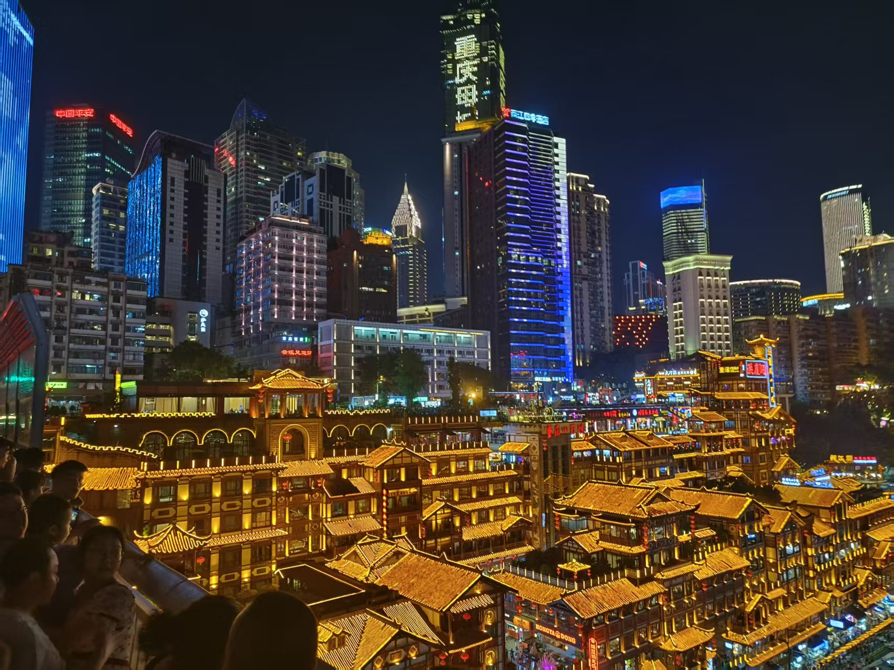
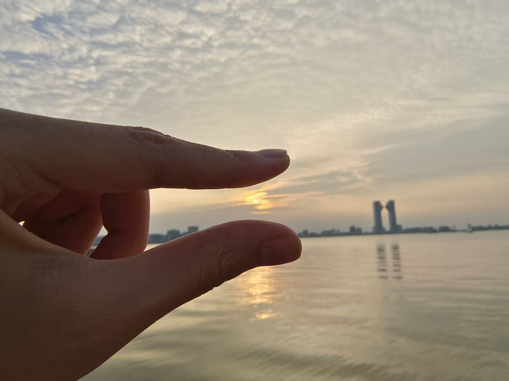
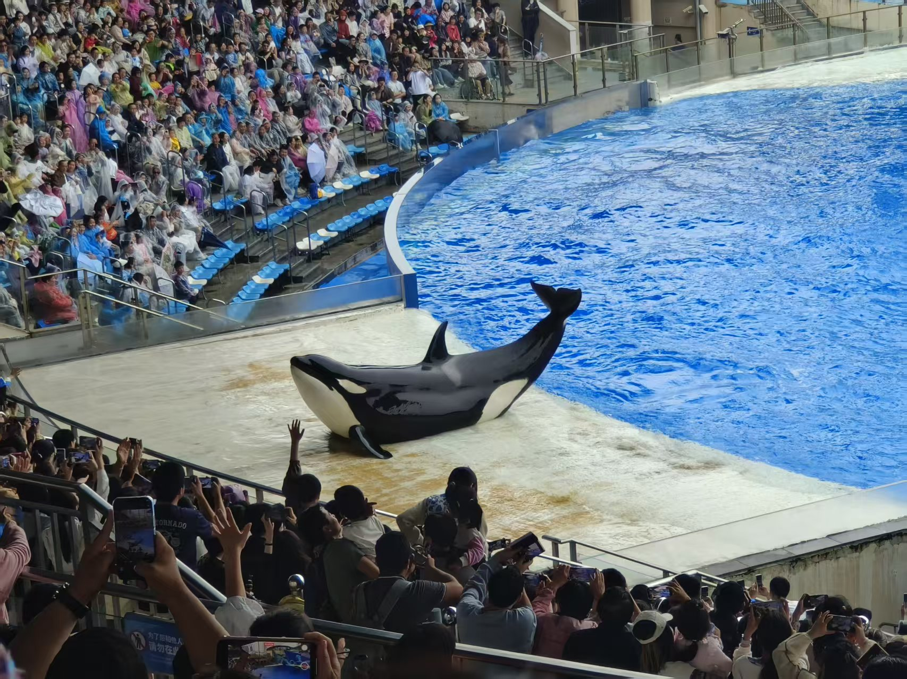
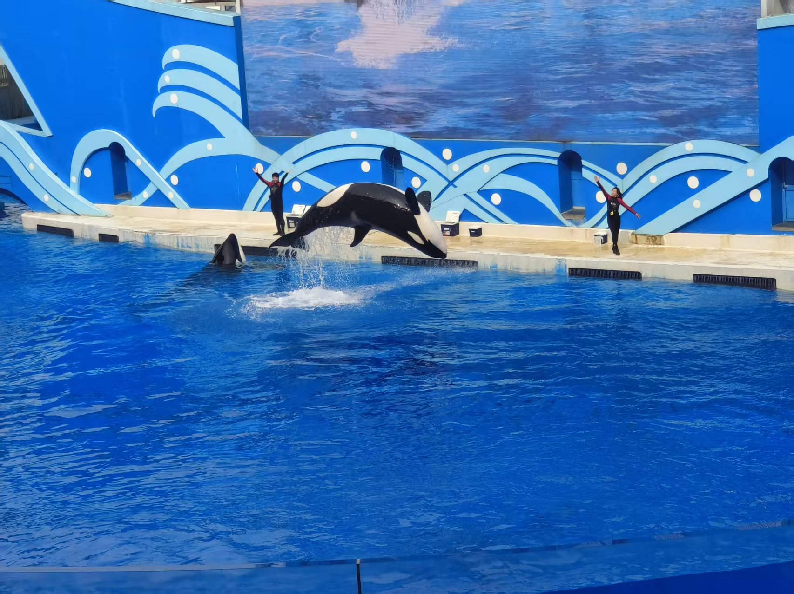
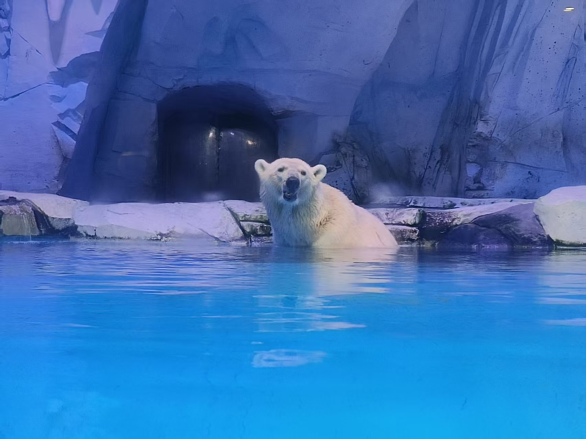

---
hide:
  - navigation # 在首页隐藏左侧导航栏，视觉更聚焦
  - toc        # 隐藏右侧目录
---

  <h1>欢迎来到我的秘密小屋</h1>
  
正在努力学习AI算法中

  
暂时没有目标，但是冲啊冲啊，先上路吧！

    

        
    

    

        
    

    

        
    

    

        
    

    

        
    

    

        
    

    

<h2>内容</h2>

    <a href="diffusion-study/" class="scifi-card">
        <h3>⚡ 算法学习</h3>
        
扩散模型

        > 学习使我快乐，吗？
    </a>

    <a href="medical-ai/" class="scifi-card">
        <h3 style="color: #ff3366;">🏥 科研学习</h3>
        
空空如也

        > 查看打工人日记
    </a>

    <a href="photography/" class="scifi-card">
        <h3 style="color: #ffd700;">📷 珍惜当下</h3>
        
生活最重要，希望大家永远快乐

        > 我和我的动物朋友
    </a>

 

 © 2024 Younginger's AI Lab | Powered by Neural Networks
